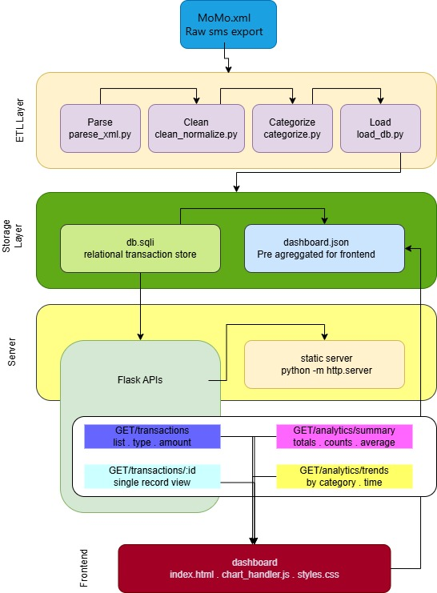

# TEAM 7 
# smartLibrary

Smart Library is a web-based enterprise library management system designed to help libraries manage books, students, borrowing records, and library operations efficiently.

# Team Members
- Divin Semana  
- Butera Irebe Asnath  
- Rusanganwa Arnaud Bertrand

# System Architecture
[View System Architecture](https://drive.google.com/file/d/1cMTkPHRwWionifNjws3VCFswhx6vTrAZ/view?usp=sharing)

# ScrumBoard - Project
[View Project scrumboard here](https://github.com/users/dsemana/projects/3/views/1)
