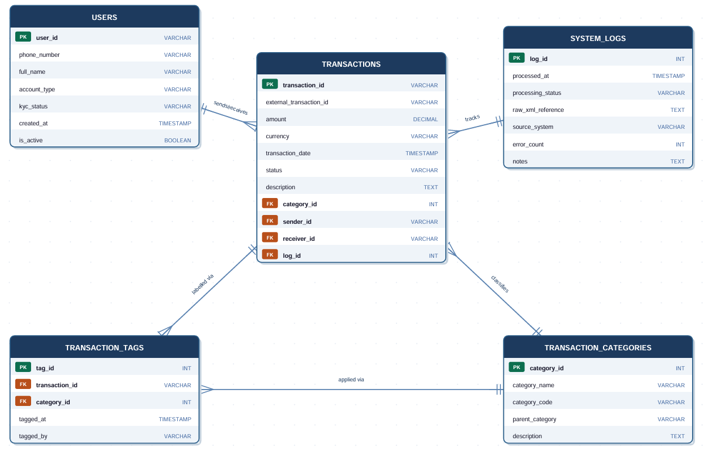

# TEAM 7 
# MoMo SMS Data Processing System

## Project Overview
This system processes MTN Mobile Money (MoMo) SMS transaction data. It parses XML-formatted SMS messages, extracts transaction details, and stores them in a structured MySQL database for querying and analysis.

# Team Members
- Divin Semana  
- Butera Irebe Asnath  
- Rusanganwa Arnaud Bertrand

# System Architecture
[View System Architecture](https://drive.google.com/file/d/1cMTkPHRwWionifNjws3VCFswhx6vTrAZ/view?usp=sharing)

# ScrumBoard - Project
[View Project scrumboard here](https://github.com/users/dsemana/projects/3/views/1)

## Database Design

### How to Run the SQL Script
1. Make sure MySQL is installed and running
2. Open your terminal or MySQL Workbench
3. Run: `mysql -u root -p < database/database_setup.sql`
4. The database `momo_sms` will be created with all tables and sample data

# ERD Design

